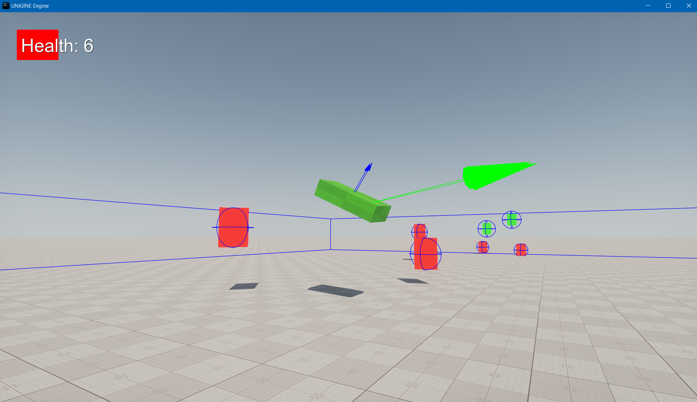

# OpenAir2023-Mosquitto-Fly
Unigine OpenAir2023 live coding project

https://www.youtube.com/watch?v=Sy_NQo1X0a4

1. install Unigine SDK BROwser
2. download and activate 2.17.0.1 SDK (SDKs -> ADD SDK -> Unigine 2 Community ->2.17.0.1 -> install -> make default)
3. add and reconfigurate this project (My Projects -> add existing -> choose .project file -> import project -> repair -> configure)
4. open Editor to generate .runtimes 
5. launch with VS2022